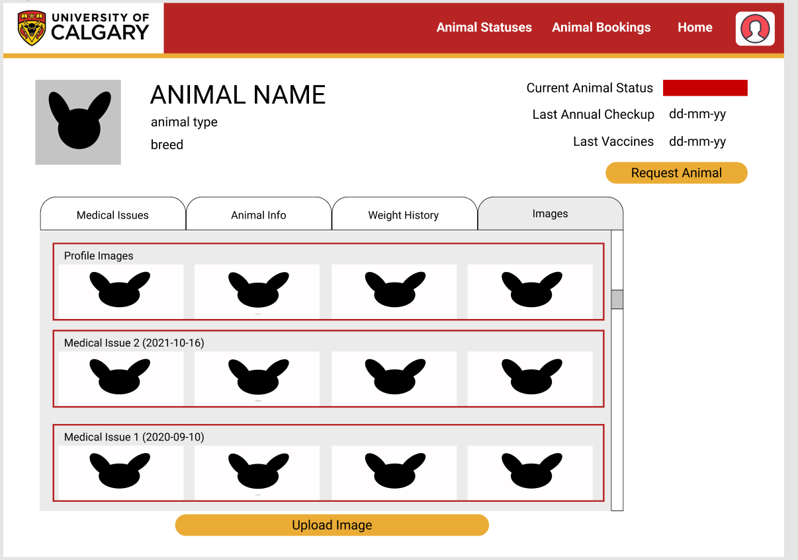

# Wireframes
The following wireframes were developed for our project using figma

1. Login Page  
2. Home Page  
3. User Profile Page  
4. Animal Profile Page: medical issues tab  
5. Animal Profile Page: animal info tab  
6. Animal Profile Page: images tab  
7. Animal Profile Page: weight history tab  
8. Animal Medical Issue Page: 
   1. This page gives details on an individual medical issue the animal has had 
   2. Ex. if an animal broke its leg 
   3. All the treatments corresponding to this issue can be found here  
9. Animal Class visit Dashboard 
   1. this dashboard is used to schedule animals for classroom visits  
10. User Management Dashboard  
11. Treatment Form 
    1. this is used to add a specific treatment for an animal's medical issue 
    2. ex. Giving an animal a checkup, to check on their broken leg  
12. Individual Medical issue form 
    1. Used to create a new medical issue 
    2. Ex. you'd open a new issue if an animal broke their leg  
13. Classroom booking request form  