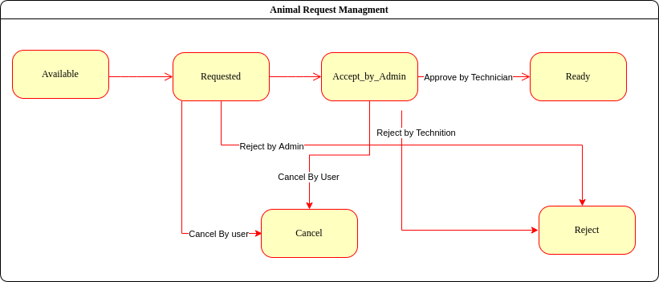
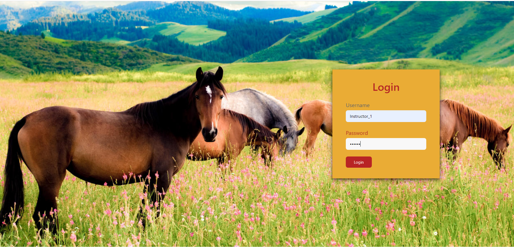
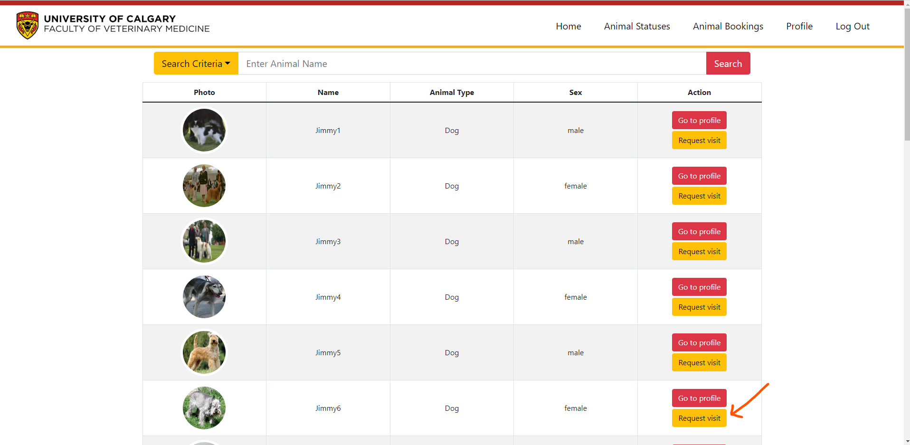
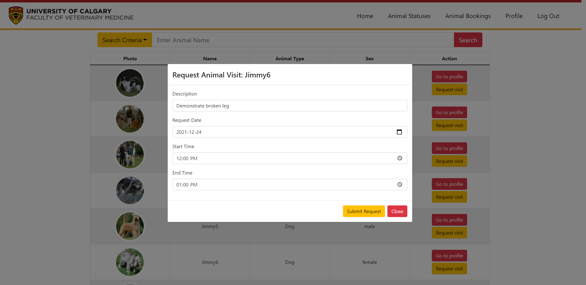
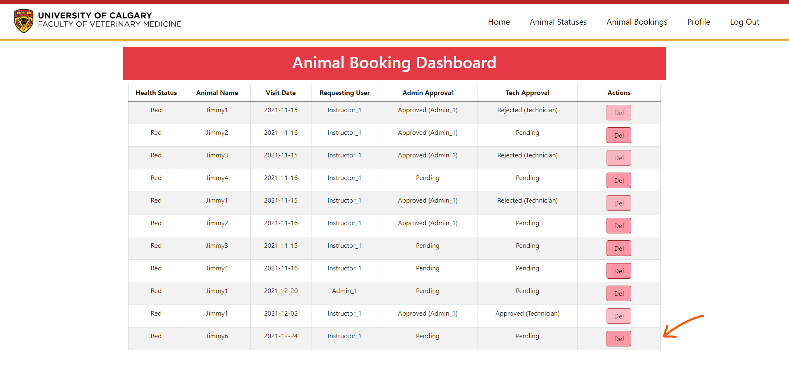
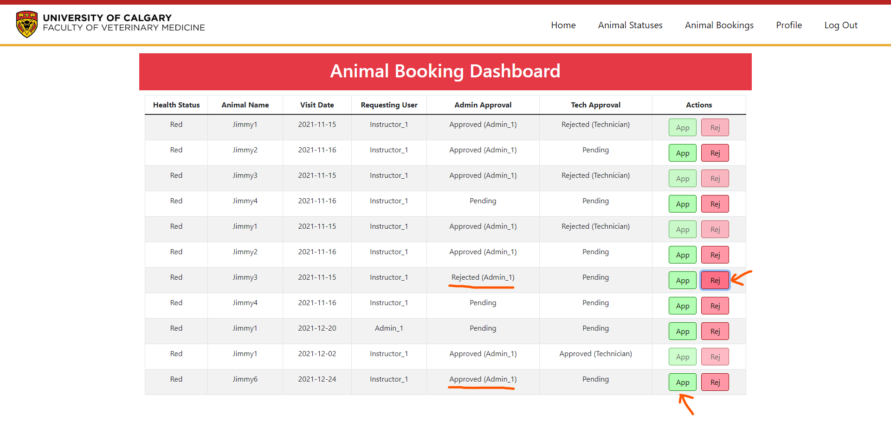
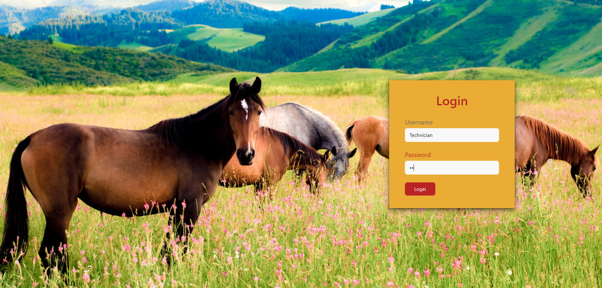
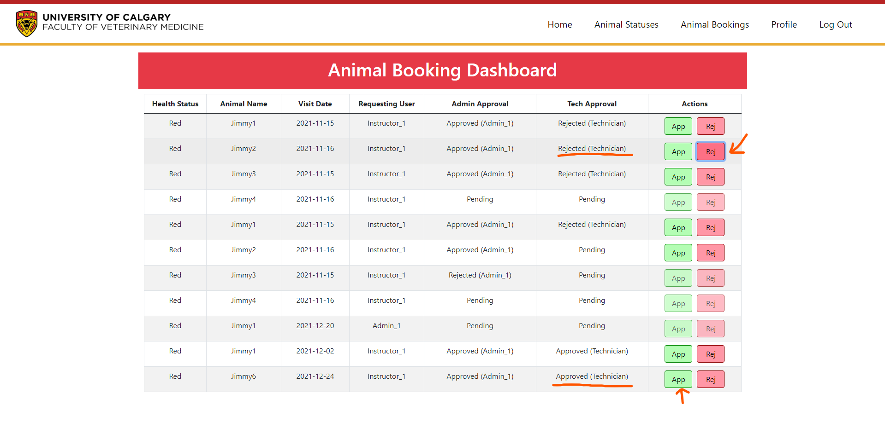
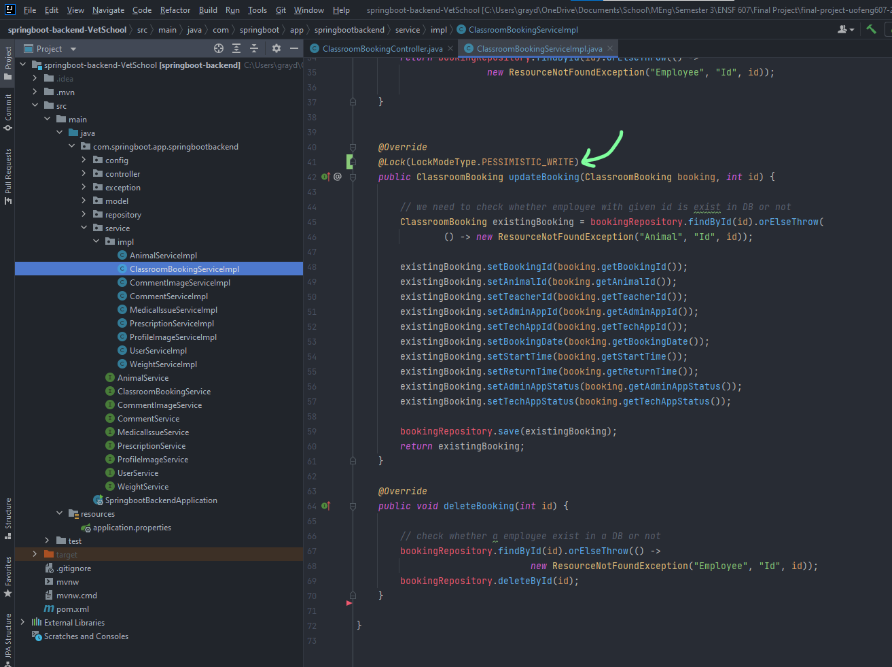

# Animal Booking Workflow
The following logic path is followed for when an in instructor wants to be booked 
for a classroom visit 
 

## Requirements
1. Instructor
    1. Can request an animal
    2. Can cancel a request
    3. Can view available animals
2. Admin
   1. Can view new requests
   2. Can Approve a request
   3. Can reject a request
3. Technician
   1. Can view new requests
   2. Can Approve a request
   3. Can reject a request
* Instructors can only cancel requests when their request is in “new” or “accepted_by_admin” states.
* The application must have a backend and frontend, and the API must connect the two.
* The application must be consistent when two users concurrently change a request state.
* Every team must commit partially every few hours.
* Each team must be based on final-project teams.
* Different roles login with these credentials:
    * Instructor_1: pass: pt@123
    * Admin_1: pass: pa
    * Technician: pass: pe

## Demonstration
1. Log in as instructor  
2. Request a visit    
3. Log in as admin  
4. Approve or request a visit  
5. Log in as technician  
6. Approve or request a visit   

## Handling two users concurrently changing a request state.
To handle this situation, we used the following JPA annotation in our Service implementation class for
handling classroom bookings. By attaching this annotation, we ensure that a pessimistic
lock is placed on the exisitingBooking object that is being edited within this method. 
More details on this method of pessimistic locking in JPA can be found at https://www.baeldung.com/jpa-pessimistic-locking  
 