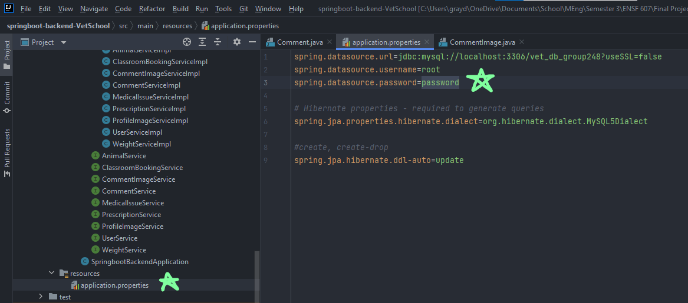

# group248
ensf 607 and 608 project

# Project Sprint 3 - API
### Instrutions to run API

#### Step 1: change your username and password for MySQL in this file here


#### Step 2: Run vet_db_gropu248.sql file to populate database

## Endpoint Examples
Below, you can find 4 test endpoints, with their Path, Verb, Request, and Response (in JSON)

#### GET Animal Weight (E248-72)

Path: "http://localhost:8080/api/weight/animalid/2" <br>
Verb: GET <br>
Request: N/A <br>
Response: <br>
```
[
    {
        "weightId": 5,
        "animalId": 2,
        "date": "2021-09-01 00:00:00",
        "weight": "22.0"
    },
    {
        "weightId": 6,
        "animalId": 2,
        "date": "2021-10-01 00:00:00",
        "weight": "23.0"
    },
    {
        "weightId": 7,
        "animalId": 2,
        "date": "2021-11-01 00:00:00",
        "weight": "24.0"
    },
    {
        "weightId": 8,
        "animalId": 2,
        "date": "2021-12-01 00:00:00",
        "weight": "25.0"
    }
]
```
#### POST User (E248-66)

Path: http://localhost:8080/api/users <br>
Verb: POST<br>
Request:<br>
```
{
    "name": "Janet",
    "email": "Janet@gmail.com",
    "password": "3456",
    "userType": "Animal Health Technician"
}
```
Response:<br>
```
{
    "userId": 6,
    "name": "Janet",
    "email": "Janet@gmail.com",
    "password": "3456",
    "userType": "Animal Health Technician"
}
```
#### DELETE Animal (E248-90)

Path: http://localhost:8080/api/animals/5 <br>
Verb: DELETE<br>
Request: N/A<br>
Response: "Animal deleted successfully!."<br>

#### PUT User (E248-65)

Path: http://localhost:8080/api/users/6<br>
Verb: PUT<br>
Request:<br>
```
{
    "name": "Janet",
    "email": "Janet@gmail.com",
    "password": "1234",
    "userType": "Animal Health Technician"
}
```
Response:<br>
```
{
    "userId": 6,
    "name": "Janet",
    "email": "Janet@gmail.com",
    "password": "1234",
    "userType": "Animal Health Technician"
}
```

#### GET Animal Medical Issues (E248-75)

Path: http://localhost:8080/api/animals/1?fields=weights,images,prescriptions <br>
Verb: GET<br>
Request: N/A<br>
Response:<br>
```
{
    "animalId": 1,
    "animalName": "Sally",
    "animalType": "Dog",
    "medicalIssues": [
        {
            "medicalIssueId": 1,
            "animalId": 1,
            "issueName": "Scratched Ear",
            "currentStatus": "Green",
            "openDate": "2020-09-01 00:00:00",
            "closeDate": "2020-09-05 00:00:00",
            "description": "Sally Cut her ear and it was bleeding",
            "treatments": [
                {
                    "treatmentId": 1,
                    "medicalIssueId": 1,
                    "title": "Give Stiches",
                    "date": "2020-09-01 00:00:00",
                    "description": "Gave sally stitches for her cut ear",
                    "treatmentImages": [
                        {
                            "treatmentphotoId": 1,
                            "treatmentId": 1,
                            "image": "img13.jpg"
                        },
                        {
                            "treatmentphotoId": 2,
                            "treatmentId": 1,
                            "image": "img14.jpg"
                        }
                    ],
                    "author": {
                        "userId": 1,
                        "name": "John",
                        "email": "John@gmail.com",
                        "password": "1234",
                        "userType": "Vet"
                    }
                },
                {
                    "treatmentId": 2,
                    "medicalIssueId": 1,
                    "title": "Remove Stiches",
                    "date": "2020-09-05 00:00:00",
                    "description": "Took out stitches for sally, issue resolved",
                    "treatmentImages": [
                        {
                            "treatmentphotoId": 3,
                            "treatmentId": 2,
                            "image": "img15.jpg"
                        },
                        {
                            "treatmentphotoId": 4,
                            "treatmentId": 2,
                            "image": "img16.jpg"
                        }
                    ],
                    "author": {
                        "userId": 1,
                        "name": "John",
                        "email": "John@gmail.com",
                        "password": "1234",
                        "userType": "Vet"
                    }
                }
            ]
        },
        {
            "medicalIssueId": 2,
            "animalId": 1,
            "issueName": "Broken Leg",
            "currentStatus": "Yellow",
            "openDate": "2021-09-01 00:00:00",
            "closeDate": null,
            "description": "Sally broke leg running",
            "treatments": [
                {
                    "treatmentId": 3,
                    "medicalIssueId": 2,
                    "title": "Splint broken leg",
                    "date": "2021-09-01 00:00:00",
                    "description": "Gave sally splint for leg. Follow up to check healing in 2 months",
                    "treatmentImages": [
                        {
                            "treatmentphotoId": 5,
                            "treatmentId": 3,
                            "image": "img17.jpg"
                        },
                        {
                            "treatmentphotoId": 6,
                            "treatmentId": 3,
                            "image": "img18.jpg"
                        }
                    ],
                    "author": {
                        "userId": 1,
                        "name": "John",
                        "email": "John@gmail.com",
                        "password": "1234",
                        "userType": "Vet"
                    }
                },
                {
                    "treatmentId": 4,
                    "medicalIssueId": 2,
                    "title": "Change splint dressing",
                    "date": "2021-10-01 00:00:00",
                    "description": "Changed dressing for Sallys splint",
                    "treatmentImages": [
                        {
                            "treatmentphotoId": 7,
                            "treatmentId": 4,
                            "image": "img19.jpg"
                        },
                        {
                            "treatmentphotoId": 8,
                            "treatmentId": 4,
                            "image": "img20.jpg"
                        }
                    ],
                    "author": {
                        "userId": 1,
                        "name": "John",
                        "email": "John@gmail.com",
                        "password": "1234",
                        "userType": "Vet"
                    }
                }
            ]
        }
    ]
}
```
