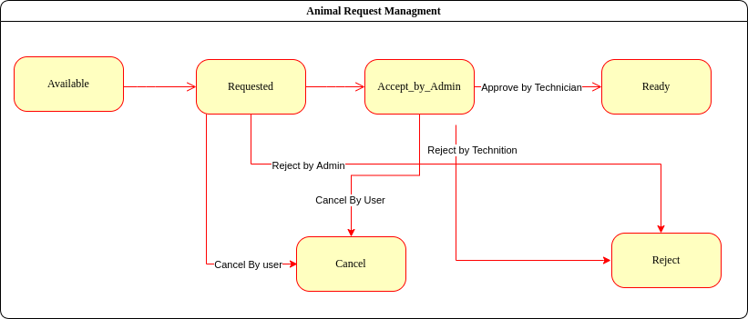

# Group 248 Vet school Application
This is our final project for ENSF 607 and 608. It is a full stack application built
for the University of Calgary School of Veterinary medicine.

## Project Sprint 3 - API
The following document outlines details regarding our API for the project.
It is built using the Spring Boot Framework, and connecting to a MySQL database. 
[Project API Documentation](MarkdownAndImages/API.md)

## Project Hackathon - Animal Booking Logic
As apart of a hackathon related to this project, we implemented the following
logic for booking animals for classroom visits. This logic is outlined in the following document. 

[Animal Booking Workflow](MarkdownAndImages/animalBooking.md) 
 
